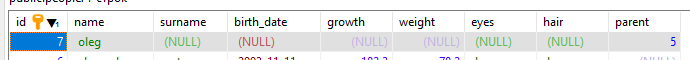

# PL/pgSQL
## Выведите на экран любое сообщение
> На экран - на экран **сервера**! Клиентское приложение данное сообщение не получит.

```SQL
DO $$
BEGIN
	RAISE NOTICE 'Мяу';
END;
$$; 
```
  
*Результат*  

## Выведите на экран текущую дату
```SQL
DO $$
BEGIN
	RAISE NOTICE '%', CURRENT_DATE;
END;
$$;
```
  
*Результат*  

## Создайте две числовые переменные и присвойте им значение. Выполните математические действия с этими числами и выведите результат на экран.
```SQL
DO $$
DECLARE 
a INT;
b INT;
BEGIN
	a := 5;
	b := 3;
	RAISE NOTICE '%', a+b;
END;
$$;
```
  
*Результат*  

## Написать программу двумя способами 1 - использование IF, 2 - использование CASE. Объявите числовую переменную и присвоейте ей значение...
```SQL
CREATE OR REPLACE PROCEDURE text_grade(grade INT)
LANGUAGE plpgsql
AS $$
BEGIN
	IF (grade = 5) THEN RAISE NOTICE 'Отлично';
	ELSIF (grade = 4) THEN RAISE NOTICE 'Хорошо';
	ELSIF (grade = 3) THEN RAISE NOTICE 'Удовлетворительно';
	ELSIF (grade = 2) THEN RAISE NOTICE 'Неудовлетворительно';
	ELSE RAISE NOTICE 'Вне границ';
	END IF;
END;
$$;
```

```SQL
CREATE OR REPLACE PROCEDURE text_grade(grade INT)
LANGUAGE plpgsql
AS $$
BEGIN
	CASE grade
		WHEN 5 THEN RAISE NOTICE 'Отлично';
		WHEN 4 THEN RAISE NOTICE 'Хорошо';
		WHEN 3 THEN RAISE NOTICE 'Удовлетворительно';
		WHEN 2 THEN RAISE NOTICE 'Неудовлетворительно';
		ELSE RAISE NOTICE 'Вне границ';
	END CASE;
END;
$$;

CALL text_grade(5);
CALL text_grade(2);
CALL text_grade(1);
```
  
*Результат*  

## Выведите все квадраты чисел от 20 до 30 3-мя разными способами (LOOP, WHILE, FOR).
```SQL
DO $$
DECLARE 
a INT;
BEGIN
	a := 20;
	LOOP
		RAISE NOTICE '%', a*a;
		a := a+1;
		EXIT WHEN a > 30;
	END LOOP;
END;
$$;
```
```SQL
DO $$
DECLARE 
a INT;
BEGIN
	a := 20;
	WHILE (a < 31)
    LOOP
		RAISE NOTICE '%', a*a;
		a := a+1;
	END LOOP;
END;
$$;
```
```SQL
DO $$
DECLARE 
a INT;
BEGIN
	FOR a IN 20..30
    LOOP
		RAISE NOTICE '%', a*a;
		a := a+1;
	END LOOP;
END;
$$;
```
  
*Результат*  

## Последовательность Коллатца
> Берётся любое натуральное число. Если чётное - делим его на 2, если нечётное, то умножаем его на 3 и прибавляем 1. Такие действия выполняются до тех пор, пока не будет получена единица. Гипотеза заключается в том, что какое бы начальное число n не было выбрано, всегда получится 1 на каком-то шаге. Задания: написать функцию, входной параметр - начальное число, на выходе - количество чисел, пока не получим 1; написать процедуру, которая выводит все числа последовательности. Входной параметр - начальное число.

```SQL
CREATE OR REPLACE FUNCTION collatz(num INT) returns INT
LANGUAGE plpgsql
AS $$
DECLARE 
count INT;
BEGIN
    count := 0;
	LOOP
        -- RAISE NOTICE '%', num;
        count := count + 1;
        IF (num % 2 = 0) THEN num := num / 2;
        ELSIF (num % 2 = 1) THEN num := num * 3 + 1; 
        END IF;
        EXIT WHEN num = 1;
    END LOOP;
    RETURN count;
END;
$$;

SELECT collatz(7);
```
  
*Результат*

```SQL
CREATE OR REPLACE PROCEDURE collatz_p(num INT)
LANGUAGE plpgsql
AS $$
BEGIN
	LOOP
        RAISE NOTICE '%', num;
        IF (num % 2 = 0) THEN num := num / 2;
        ELSIF (num % 2 = 1) THEN num := num * 3 + 1; 
        END IF;
        EXIT WHEN num = 1;
    END LOOP;
END;
$$;

CALL collatz_p(7);
```
  
*Результат*  

## Числа Люка
> Объявляем и присваиваем значение переменной - количество числе Люка. Вывести на экран последовательность чисел. Где L0 = 2, L1 = 1 ; Ln=Ln-1 + Ln-2 (сумма двух предыдущих чисел). Задания: написать фунцию, входной параметр - количество чисел, на выходе - последнее число (Например: входной 5, 2 1 3 4 7 - на выходе число 7); написать процедуру, которая выводит все числа последовательности. Входной параметр - количество чисел.

```SQL
CREATE OR REPLACE FUNCTION luke_f(target INT) returns INT
LANGUAGE plpgsql
AS $$
DECLARE 
count INT;
num_1 INT;
num_2 INT;
BEGIN
    num_1 := 2;
    num_2 := 1;
    count := 2;
    WHILE (count < target)
	LOOP
        count := count + 1;
        num_2 := num_1 + num_2;
        num_1 := num_2 - num_1;
    END LOOP;
    RETURN num_2;
END;
$$;

SELECT luke_f(5);
```
  
*Результат*

```SQL
CREATE OR REPLACE PROCEDURE luke_p(target INT)
LANGUAGE plpgsql
AS $$
DECLARE 
count INT;
num_1 INT;
num_2 INT;
BEGIN
    num_1 := 2;
    num_2 := 1;
    count := 2;
    RAISE NOTICE '2';
    RAISE NOTICE '1';
    WHILE (count < target)
	LOOP
        count := count + 1;
        num_2 := num_1 + num_2;
        num_1 := num_2 - num_1;
        RAISE NOTICE '%', num_2;
    END LOOP;
END;
$$;

CALL luke_p(5);
```
  
*Результат*  

## Напишите функцию, которая возвращает количество человек родившихся в заданном году
```SQL
CREATE OR REPLACE FUNCTION born_in(year_target INT) returns INT
LANGUAGE plpgsql
AS $$
DECLARE 
count INT;
BEGIN
    SELECT COUNT(*) INTO count
    FROM people
    WHERE extract(year from people.birth_date) = year_target;
    RETURN count;
END;
$$;

SELECT born_in(1995);
```
  
*Результат*

## Напишите функцию, которая возвращает количество человек с заданным цветом глаз.
```SQL
CREATE OR REPLACE FUNCTION eye_color(color VARCHAR) returns INT
LANGUAGE plpgsql
AS $$
DECLARE 
count INT;
BEGIN
    SELECT COUNT(*) INTO count
    FROM people
    WHERE people.eyes = color;
    RETURN count;
END;
$$;

SELECT eye_color('brown');
```
  
*Результат*

## Напишите функцию, которая возвращает ID самого молодого человека в таблице.
```SQL
CREATE OR REPLACE FUNCTION youngest() returns INT
LANGUAGE plpgsql
AS $$
DECLARE 
num INT;
BEGIN
    SELECT people.id INTO num
    FROM people
    ORDER BY people.birth_date DESC
    LIMIT 1;
    RETURN num;
END;
$$;

SELECT youngest();
```
  
*Результат*

## Напишите процедуру, которая возвращает людей с индексом массы тела больше заданного. ИМТ = масса в кг / (рост в м)^2.
> Процедура не возвращает значения. Пишем функцию.
```SQL
CREATE OR REPLACE FUNCTION b_ind_gt(target INT) RETURNS TABLE (id INT)
LANGUAGE plpgsql
AS $$
BEGIN
	RETURN QUERY
	SELECT people.id
	FROM people
	WHERE people.weight / (people.growth/100)*(people.growth/100) > target;
END;
$$;

SELECT * FROM b_ind_gt(50);
```
  
*Результат*

## Измените схему БД так, чтобы в БД можно было хранить родственные связи между людьми. 
> Код должен быть представлен в виде транзакции (Например (добавление атрибута): BEGIN; ALTER TABLE people ADD COLUMN leg_size REAL; COMMIT;). Дополните БД данными.

> По уму, создается отдельная таблица, в которой хранятся связи между родителем и ребенком. Проигнорируем данный вариант здесь и просто добавим поле родственника.

Все команды между `BEGIN` и `COMMIT` являются транзакцией - они либо выполнятся все, либо не выполнится ни одна. При ошибке при выполнении состояние базы откатывается назад до `BEGIN`, что обеспечивает атомарность транзакции.
```SQL
BEGIN;
ALTER TABLE people ADD COLUMN parent INT;
COMMIT;
```

## Напишите процедуру, которая позволяет создать в БД нового человека с указанным родством.
> Опустим все параметры, которые не необходимы. При желании, они добавляются в параметры функции и в INSERT.

```SQL
CREATE OR REPLACE PROCEDURE add_child(parent INT, name VARCHAR)
LANGUAGE plpgsql
AS $$
BEGIN
    INSERT INTO people (name, parent) VALUES (name, parent);
END;
$$;

CALL add_child(5, 'oleg');
```
  
*Результат*  

## Измените схему БД так, чтобы в БД можно было хранить время актуальности данных человека (выполнить также, как п.12).
> Время актуальности, как правило, задается в клиентском приложении. В БД разумнее хранить дату последнего изменения. Так обеспечивается беспроблемное изменение периода актуальности.  
При требовании отдельного времени для каждого пользователя добавляется это значение. Дата, до которой данные актуальны, все еще плохое решение.

```SQL
BEGIN;
ALTER TABLE people ADD COLUMN last_update DATE;
UPDATE people SET last_update=CURRENT_DATE;
COMMIT;
```

## Напишите процедуру, которая позволяет актуализировать рост и вес человека.

```SQL
CREATE OR REPLACE PROCEDURE update_data(target INT, t_height REAL, t_weight REAL)
LANGUAGE plpgsql
AS $$
BEGIN
    UPDATE people SET growth=t_height, weight=t_weight, last_update=CURRENT_DATE WHERE id = target;
END;
$$;

CALL update_data(5, 170, 66.6);
```