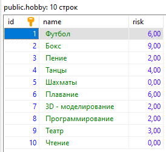
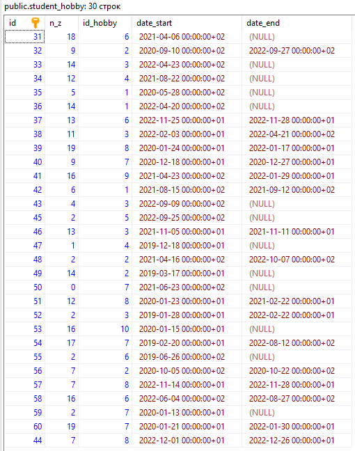

# Задание 2
## Содержание
 - [Таблицы](#таблицы)
 - [Однотабличные запросы](#однотабличные-запросы)
 - [Групповые функции](#групповые-функции)
# Таблица
Визуализация базы данных, чтобы была возможность сверить правильность выполнения запросов.  
  
*Список студентов*  

  
*Список хобби*  

  
*Ассоциации между студентами и хобби*  

# Однотабличные запросы
## Вывести всеми возможными способами имена и фамилии студентов, средний балл которых от 4 до 4.5
Исполняем SQL-запрос, указанный ниже.  
`SELECT` - получаем строки из таблицы.  
`FROM ...` - таблица, из которой получаем данные.  
`WHERE ...` - критерии, определяющие, какие строки вернутся.
```SQL
SELECT name,surname FROM students WHERE score >= 4.0 AND score <= 4.5
```
  
*Результат*  

## Познакомиться с функцией CAST. Вывести при помощи неё студентов заданного курса (использовать Like)
Исполняем SQL-запрос, указанный ниже. Возможны разные варианты, рассмотрим оба предложенных.  
`CAST (... AS ...)` - изменяет тип переменной, указанной в первом параметре на тип, указанный во втором параметре.  
`... :: ...` - аналогичная функция, иной формат записи.  
Функции `CAST (st.group_num AS VARCHAR)` и `st.group_num::VARCHAR` идентичны друг другу.  
`LEFT(..., ...)` - возвращает указанное количество символов с левого конца строки.  
`... LIKE ...` - проверяет соответствие строки указанному шаблону. Возможна запись как `... ~~ ...`   
### Шаблоны LIKE
 - `%` - соответствует нулю или более символов
 - `_` - соотвествует строго одному символу
```SQL
SELECT * FROM students st WHERE LEFT(st.group_num::VARCHAR,1) = '2'
```

```SQL
SELECT * FROM students st WHERE CAST(st.group_num AS VARCHAR) LIKE '2%'
```
Оба запроса возвращают одинаковый результат.  
  
*Результат*

## Вывести всех студентов, отсортировать по убыванию номера группы и имени от А до Я
Исполняем SQL-запрос, указанный ниже.  
`ORDER BY ...` - порядок, в котором вернутся запрошенные записи.  
Может иметь несколько критериев, разделенных запятой.  
`... ASC` после критерия - отсортировать по возрастанию, `... DESC` - отсортировать по убыванию.  
```SQL
SELECT * FROM students st ORDER BY st.group_num DESC, st.name
```
  
*Результат*  

## Вывести студентов, средний балл которых больше 4, и отсортировать по баллу от большего к меньшему
Исполняем SQL-запрос, указанный ниже.  
Объединяем параметры `WHERE` и `ORDER BY` в одном запросе.  
```SQL
SELECT * FROM students st WHERE st.score >= 4.0 ORDER BY st.score DESC
```
  
*Результат*  

## Вывести на экран название и риск футбола и хоккея
Хоккей отсутствует в базе хобби, заменим его на бокс.  
Исполняем SQL-запрос, указанный ниже.  
```SQL
SELECT h.name, h.risk FROM hobby h WHERE h.name = 'Футбол' OR h.name = 'Бокс'
```
  
*Результат*  

## Вывести ID хобби и ID студента, которые начали заниматься хобби между двумя заданными датами (выбрать самим) и студенты должны до сих пор заниматься хобби
Исполняем SQL-запрос, указанный ниже.  
С помощью `WHERE` устанавливаем диапазон дат начала, и используя проверку `IS NULL` проверяем, что студент все еще занимается хобби.  
```SQL
SELECT st_h.n_z, st_h.id_hobby FROM student_hobby st_h WHERE st_h.date_start > '2021-01-01' AND st_h.date_start < '2022-01-01' AND st_h.date_end IS NULL
```
  
*Результат*  

## Вывести студентов, средний балл которых больше 4.5 и отсортировать по баллу от большего к меньшему
Исполняем SQL-запрос, указанный ниже.  
```SQL
SELECT * FROM students st WHERE st.score >= 4.5 ORDER BY st.score DESC
```
  
*Результат*  

## Из предыдущего запроса вывести несколькими способами на экран только 5 студентов с максимальным баллом
Так как студентов всего 5, выводим только первых трех.  
Исполняем SQL-запрос, указанный ниже.  
`LIMIT ...` ограничивает количество возвращаемых строк.  
`FETCH FIRST ... ROWS ONLY` - аналогичное ограничение количества возвращаемых строк.  
```SQL
SELECT * FROM students st WHERE st.score >= 4.5 ORDER BY st.score DESC LIMIT 3
```
```SQL
SELECT * FROM students st WHERE st.score >= 4.5 ORDER BY st.score DESC FETCH FIRST 3 ROWS ONLY
```
Оба запроса возвращают одинаковый результат.  
  
*Результат*  

## Выведите хобби и с использованием условного оператора сделайте риск словами
Исполняем SQL-запрос, указанный ниже.  
`CASE ... END` позволяет сравнить некое значение сразу с несколькими условиями.  
`WHEN ... THEN ...` - условная конструкция, которая возвращает значение после `THEN`, если удовлетворяется заданное условие.  
```SQL
SELECT h.name,
CASE 
WHEN h.risk < 2 THEN 'Очень низкий'
WHEN h.risk >= 2 AND h.risk < 4 THEN 'Низкий'
WHEN h.risk >= 4 AND h.risk < 6 THEN 'Средний'
WHEN h.risk >= 6 AND h.risk < 8 THEN 'Высокий'
WHEN h.risk >= 8 THEN 'Очень высокий'
END risk
FROM hobby h 
```
  
*Результат*  

## Вывести 3 хобби с максимальным риском
Исполняем SQL-запрос, указанный ниже.  
```SQL
SELECT * FROM hobby h ORDER BY h.risk DESC LIMIT 3
```
  
*Результат*  

# Групповые функции
## Выведите на экран номера групп и количество студентов, обучающихся в них
Исполняем SQL-запрос, указанный ниже.  
`GROUP BY ...` определяет колонку, по которой группируются атрибуты.  
`COUNT(...)` производит заданную операцию над сгруппированными данными, в данном случае - подсчет количества строк.  
```SQL
SELECT st.group_num, COUNT(st.n_z) FROM students st GROUP BY st.group_num
```
  
*Результат*  

## Выведите на экран для каждой группы максимальный средний балл
Исполняем SQL-запрос, указанный ниже.  
Используем групповую функцию `MAX(...)` для выбора максимального значения атрибута в группе.  
```SQL
SELECT st.group_num, MAX(st.score) FROM students st GROUP BY st.group_num
```
  
*Результат*  

## Подсчитать количество студентов с каждой фамилией
Исполняем SQL-запрос, указанный ниже.  
Изменяем атрибут, по которому выполняется группировка.  
```SQL
SELECT st.surname, COUNT(st.surname) FROM students st GROUP BY st.surname
```
  
*Результат*  

## Подсчитать студентов, которые родились в каждом году
Исполняем SQL-запрос, указанный ниже.  
`EXTRACT(... FROM ...)` позволяет получить некое определенное поле из даты.  
```SQL
SELECT 
  EXTRACT(YEAR FROM st.date_of_birth), 
  COUNT(EXTRACT(YEAR FROM st.date_of_birth)) 
FROM students st 
GROUP BY 
  EXTRACT(YEAR FROM st.date_of_birth)
```
  
*Результат*  

## Для студентов каждого курса подсчитать средний балл
Исполняем SQL-запрос, указанный ниже.  
Воспользуемся прежде написанной функцией, возвращающей курс студента.  
```SQL
SELECT 
  LEFT(st.group_num::VARCHAR,1) grade, 
  ROUND(AVG(st.score),2) score 
FROM students st 
GROUP BY 
  LEFT(st.group_num::VARCHAR,1)
```
  
*Результат*  

## Для студентов заданного курса вывести один номер группы с максимальным средним баллом
Исполняем SQL-запрос, указанный ниже.  
Берем номера групп...  
...которые с первого курса...  
...группируем данные по группам, так как нас интересует номер группы...  
...сортируем по среднему баллу...  
...получаем только самый максимальный номер.  
```SQL
SELECT st.group_num 
FROM students st
WHERE
  LEFT(st.group_num::VARCHAR,1) = '1'
GROUP BY
  st.group_num
ORDER BY 
  AVG(st.score) DESC
LIMIT 1
```
  
*Результат*  

## Для каждой группы подсчитать средний балл, вывести на экран только те номера групп и их средний балл, в которых он менее или равен 3.5. Отсортировать по от меньшего среднего балла к большему.
Исполняем SQL-запрос, указанный ниже.  
`HAVING` похож на `WHERE`, но используется для групповых функций.  
```SQL
SELECT st.group_num, ROUND(AVG(st.score),2) score
FROM students st
GROUP BY
  st.group_num
HAVING
  AVG(st.score) > 3.5
ORDER BY 
  AVG(st.score)
```
  
*Результат*  

## Для каждой группы в одном запросе вывести количество студентов, максимальный балл в группе, средний балл в группе, минимальный балл в группе
Исполняем SQL-запрос, указанный ниже.  
```SQL
SELECT 
  st.group_num,
  COUNT(st.n_z) student_count,
  MAX(st.score),
  ROUND(AVG(st.score),2),
  MIN(st.score)
FROM students st
GROUP BY
  st.group_num
```
  
*Результат*  

## Вывести студента/ов, который/ые имеют наибольший балл в заданной группе
Исполняем SQL-запрос, указанный ниже.  
Используем обращение к нескольким таблицам, создавая таблицу максимального количества баллов в каждой группе.  
```SQL
SELECT st.*
FROM 
  (SELECT * FROM 
    (SELECT st.group_num, MAX(st.score) FROM students st GROUP BY st.group_num) gr_max
  WHERE gr_max.group_num = '2281') temp_res,
  students st
WHERE
  temp_res.group_num = st.group_num AND temp_res.max = st.score
```
  
*Результат*  

## Аналогично предыдущему заданию, но вывести в одном запросе для каждой группы студента с максимальным баллом.
Исполняем SQL-запрос, указанный ниже.  
```SQL
SELECT st.*
FROM 
  (SELECT st.group_num, MAX(st.score) FROM students st GROUP BY st.group_num) gr_max,
  students st
WHERE
  gr_max.group_num = st.group_num AND gr_max.max = st.score
```
  
*Результат*  