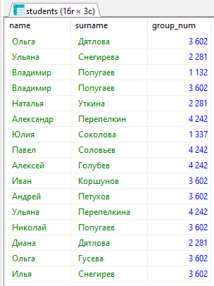

# Задание 2
## Содержание
 - [Таблицы](#таблицы)
 - [Однотабличные запросы](#однотабличные-запросы)
 - [Групповые функции](#групповые-функции)
 - [Многотабличные запросы](#многотабличные-запросы)

# Таблица
Визуализация базы данных, чтобы была возможность сверить правильность выполнения запросов.  
  
*Список студентов*  

  
*Список хобби*  

  
*Ассоциации между студентами и хобби*  

# Однотабличные запросы
## Вывести всеми возможными способами имена и фамилии студентов, средний балл которых от 4 до 4.5
Исполняем SQL-запрос, указанный ниже.  
`SELECT` - получаем строки из таблицы.  
`FROM ...` - таблица, из которой получаем данные.  
`WHERE ...` - критерии, определяющие, какие строки вернутся.
```SQL
SELECT name,surname FROM students WHERE score >= 4.0 AND score <= 4.5
```
  
*Результат*  

## Познакомиться с функцией CAST. Вывести при помощи неё студентов заданного курса (использовать Like)
Исполняем SQL-запрос, указанный ниже. Возможны разные варианты, рассмотрим оба предложенных.  
`CAST (... AS ...)` - изменяет тип переменной, указанной в первом параметре на тип, указанный во втором параметре.  
`... :: ...` - аналогичная функция, иной формат записи.  
Функции `CAST (st.group_num AS VARCHAR)` и `st.group_num::VARCHAR` идентичны друг другу.  
`LEFT(..., ...)` - возвращает указанное количество символов с левого конца строки.  
`... LIKE ...` - проверяет соответствие строки указанному шаблону. Возможна запись как `... ~~ ...`   
### Шаблоны LIKE
 - `%` - соответствует нулю или более символов
 - `_` - соотвествует строго одному символу
```SQL
SELECT * FROM students st WHERE LEFT(st.group_num::VARCHAR,1) = '2'
```

```SQL
SELECT * FROM students st WHERE CAST(st.group_num AS VARCHAR) LIKE '2%'
```
Оба запроса возвращают одинаковый результат.  
  
*Результат*

## Вывести всех студентов, отсортировать по убыванию номера группы и имени от А до Я
Исполняем SQL-запрос, указанный ниже.  
`ORDER BY ...` - порядок, в котором вернутся запрошенные записи.  
Может иметь несколько критериев, разделенных запятой.  
`... ASC` после критерия - отсортировать по возрастанию, `... DESC` - отсортировать по убыванию.  
```SQL
SELECT * FROM students st ORDER BY st.group_num DESC, st.name
```
  
*Результат*  

## Вывести студентов, средний балл которых больше 4, и отсортировать по баллу от большего к меньшему
Исполняем SQL-запрос, указанный ниже.  
Объединяем параметры `WHERE` и `ORDER BY` в одном запросе.  
```SQL
SELECT * FROM students st WHERE st.score >= 4.0 ORDER BY st.score DESC
```
  
*Результат*  

## Вывести на экран название и риск футбола и хоккея
Хоккей отсутствует в базе хобби, заменим его на бокс.  
Исполняем SQL-запрос, указанный ниже.  
```SQL
SELECT h.name, h.risk FROM hobby h WHERE h.name = 'Футбол' OR h.name = 'Бокс'
```
  
*Результат*  

## Вывести ID хобби и ID студента, которые начали заниматься хобби между двумя заданными датами (выбрать самим) и студенты должны до сих пор заниматься хобби
Исполняем SQL-запрос, указанный ниже.  
С помощью `WHERE` устанавливаем диапазон дат начала, и используя проверку `IS NULL` проверяем, что студент все еще занимается хобби.  
```SQL
SELECT st_h.n_z, st_h.id_hobby FROM student_hobby st_h WHERE st_h.date_start > '2021-01-01' AND st_h.date_start < '2022-01-01' AND st_h.date_end IS NULL
```
  
*Результат*  

## Вывести студентов, средний балл которых больше 4.5 и отсортировать по баллу от большего к меньшему
Исполняем SQL-запрос, указанный ниже.  
```SQL
SELECT * FROM students st WHERE st.score >= 4.5 ORDER BY st.score DESC
```
  
*Результат*  

## Из предыдущего запроса вывести несколькими способами на экран только 5 студентов с максимальным баллом
Так как студентов всего 5, выводим только первых трех.  
Исполняем SQL-запрос, указанный ниже.  
`LIMIT ...` ограничивает количество возвращаемых строк.  
`FETCH FIRST ... ROWS ONLY` - аналогичное ограничение количества возвращаемых строк.  
```SQL
SELECT * FROM students st WHERE st.score >= 4.5 ORDER BY st.score DESC LIMIT 3
```
```SQL
SELECT * FROM students st WHERE st.score >= 4.5 ORDER BY st.score DESC FETCH FIRST 3 ROWS ONLY
```
Оба запроса возвращают одинаковый результат.  
  
*Результат*  

## Выведите хобби и с использованием условного оператора сделайте риск словами
Исполняем SQL-запрос, указанный ниже.  
`CASE ... END` позволяет сравнить некое значение сразу с несколькими условиями.  
`WHEN ... THEN ...` - условная конструкция, которая возвращает значение после `THEN`, если удовлетворяется заданное условие.  
```SQL
SELECT h.name,
CASE 
WHEN h.risk < 2 THEN 'Очень низкий'
WHEN h.risk >= 2 AND h.risk < 4 THEN 'Низкий'
WHEN h.risk >= 4 AND h.risk < 6 THEN 'Средний'
WHEN h.risk >= 6 AND h.risk < 8 THEN 'Высокий'
WHEN h.risk >= 8 THEN 'Очень высокий'
END risk
FROM hobby h 
```
  
*Результат*  

## Вывести 3 хобби с максимальным риском
Исполняем SQL-запрос, указанный ниже.  
```SQL
SELECT * FROM hobby h ORDER BY h.risk DESC LIMIT 3
```
  
*Результат*  

# Групповые функции
## Выведите на экран номера групп и количество студентов, обучающихся в них
Исполняем SQL-запрос, указанный ниже.  
`GROUP BY ...` определяет колонку, по которой группируются атрибуты.  
`COUNT(...)` производит заданную операцию над сгруппированными данными, в данном случае - подсчет количества строк.  
```SQL
SELECT st.group_num, COUNT(st.n_z) FROM students st GROUP BY st.group_num
```
  
*Результат*  

## Выведите на экран для каждой группы максимальный средний балл
Исполняем SQL-запрос, указанный ниже.  
Используем групповую функцию `MAX(...)` для выбора максимального значения атрибута в группе.  
```SQL
SELECT st.group_num, MAX(st.score) FROM students st GROUP BY st.group_num
```
  
*Результат*  

## Подсчитать количество студентов с каждой фамилией
Исполняем SQL-запрос, указанный ниже.  
Изменяем атрибут, по которому выполняется группировка.  
```SQL
SELECT st.surname, COUNT(st.surname) FROM students st GROUP BY st.surname
```
  
*Результат*  

## Подсчитать студентов, которые родились в каждом году
Исполняем SQL-запрос, указанный ниже.  
`EXTRACT(... FROM ...)` позволяет получить некое определенное поле из даты.  
```SQL
SELECT 
  EXTRACT(YEAR FROM st.date_of_birth), 
  COUNT(EXTRACT(YEAR FROM st.date_of_birth)) 
FROM students st 
GROUP BY 
  EXTRACT(YEAR FROM st.date_of_birth)
```
  
*Результат*  

## Для студентов каждого курса подсчитать средний балл
Исполняем SQL-запрос, указанный ниже.  
Воспользуемся прежде написанной функцией, возвращающей курс студента.  
```SQL
SELECT 
  LEFT(st.group_num::VARCHAR,1) grade, 
  ROUND(AVG(st.score),2) score 
FROM students st 
GROUP BY 
  LEFT(st.group_num::VARCHAR,1)
```
  
*Результат*  

## Для студентов заданного курса вывести один номер группы с максимальным средним баллом
Исполняем SQL-запрос, указанный ниже.  
Берем номера групп...  
...которые с первого курса...  
...группируем данные по группам, так как нас интересует номер группы...  
...сортируем по среднему баллу...  
...получаем только самый максимальный номер.  
```SQL
SELECT st.group_num 
FROM students st
WHERE
  LEFT(st.group_num::VARCHAR,1) = '1'
GROUP BY
  st.group_num
ORDER BY 
  AVG(st.score) DESC
LIMIT 1
```
  
*Результат*  

## Для каждой группы подсчитать средний балл, вывести на экран только те номера групп и их средний балл, в которых он менее или равен 3.5. Отсортировать по от меньшего среднего балла к большему.
Исполняем SQL-запрос, указанный ниже.  
`HAVING` похож на `WHERE`, но используется для групповых функций.  
```SQL
SELECT st.group_num, ROUND(AVG(st.score),2) score
FROM students st
GROUP BY
  st.group_num
HAVING
  AVG(st.score) > 3.5
ORDER BY 
  AVG(st.score)
```
  
*Результат*  

## Для каждой группы в одном запросе вывести количество студентов, максимальный балл в группе, средний балл в группе, минимальный балл в группе
Исполняем SQL-запрос, указанный ниже.  
```SQL
SELECT 
  st.group_num,
  COUNT(st.n_z) student_count,
  MAX(st.score),
  ROUND(AVG(st.score),2),
  MIN(st.score)
FROM students st
GROUP BY
  st.group_num
```
  
*Результат*  

## Вывести студента/ов, который/ые имеют наибольший балл в заданной группе
Исполняем SQL-запрос, указанный ниже.  
Используем обращение к нескольким таблицам, создавая таблицу максимального количества баллов в каждой группе.  
```SQL
SELECT st.*
FROM 
  (SELECT * FROM 
    (SELECT st.group_num, MAX(st.score) FROM students st GROUP BY st.group_num) gr_max
  WHERE gr_max.group_num = '2281') temp_res,
  students st
WHERE
  temp_res.group_num = st.group_num AND temp_res.max = st.score
```
  
*Результат*  

## Аналогично предыдущему заданию, но вывести в одном запросе для каждой группы студента с максимальным баллом.
Исполняем SQL-запрос, указанный ниже.  
```SQL
SELECT st.*
FROM 
  (SELECT st.group_num, MAX(st.score) FROM students st GROUP BY st.group_num) gr_max,
  students st
WHERE
  gr_max.group_num = st.group_num AND gr_max.max = st.score
```
  
*Результат*  

# Многотабличные запросы
## Вывести все имена и фамилии студентов, и название хобби, которым занимается этот студент
Исполняем SQL-запрос, указанный ниже.  
Необходимо обратиться ко всем трем таблицам, чтобы получить имя студента и название хобби, а также связь между ними.  
Проверка `IS NULL` удостоверяется в том, что студент все еще занимается хобби. Если ее убрать, то получим список хобби, которыми студент занимался когда-то и занимается сейчас.  
```SQL
SELECT 
  st.name, st.surname, h.name 
FROM students st, student_hobby sth, hobby h 
WHERE 
  st.n_z = sth.n_z AND 
  sth.id_hobby = h.id AND 
  sth.date_end IS NULL
```
  
*Результат*  

## Вывести информацию о студенте, занимающимся хобби самое продолжительное время
Исполняем SQL-запрос, указанный ниже.  
Возможны несколько вариантов. Первый использует подзапрос, который возвращает, сколько студенты занимались хобби, после чего возвращает студента с номером зачетки, находящегося сверху списка.  
Второй объединяет таблицу студентов с временем их занятия хобби, после чего возвращает студента, занимавшегося хобби самое продолжительное время.  
`INNER JOIN ... ON ...` присоединяет к исходной таблице атрибуты из второй, где заданное выражение совпадает.  
```SQL
SELECT * FROM students st
WHERE st.n_z IN
  (SELECT t.n_z FROM
    (SELECT 
      sth.n_z, 
      sth.date_end - sth.date_start do_time 
    FROM student_hobby sth 
    WHERE 
      sth.date_end - sth.date_start IS NOT NULL 
    ORDER BY do_time DESC 
    LIMIT 1) t
) 
```
```SQL
SELECT * FROM students st 
INNER JOIN 
  (SELECT 
    sth.n_z, 
    sth.date_end - sth.date_start do_time 
  FROM student_hobby sth 
  WHERE sth.date_end - sth.date_start IS NOT NULL) sth 
ON st.n_z = sth.n_z 
ORDER BY do_time DESC 
LIMIT 1
```
  
*Результат*  

## Вывести имя, фамилию, номер зачетки и дату рождения для студентов, средний балл которых выше среднего, а сумма риска всех хобби, которыми он занимается в данный момент, больше 9.
Исполняем SQL-запрос, указанный ниже.  
Подзапрос в `FROM` возвращает ID зачеток студентов, чей общий риск хобби больше 9.  
Подзапрос в `WHERE` возвращает среднее значение баллов.  
```SQL
SELECT st.n_z, st.name, st.surname, st.date_of_birth
FROM 
  students st,
  (SELECT sth.n_z, SUM(h.risk)
    FROM hobby h
    INNER JOIN student_hobby sth
    ON h.id = sth.id_hobby
    GROUP BY sth.n_z
    HAVING SUM(h.risk) > 9) hrisk
WHERE 
  st.score > (SELECT ROUND(AVG(st.score),2) FROM students st) AND
  hrisk.n_z = st.n_z
```
  
*Результат*  

## Вывести фамилию, имя, зачетку, дату рождения, название хобби и длительность в месяцах, для всех завершенных хобби
Исполняем SQL-запрос, указанный ниже.  
Объединяем все три таблицы, чтобы строка содержала студента и его хобби. Добавляем данные о времени, сколько студент занимался хобби.  
```SQL
SELECT st.n_z, st.name, st.surname, st.date_of_birth, h.name, sth.do_time FROM students st 
INNER JOIN 
  (SELECT 
    sth.n_z, 
    sth.id_hobby,
    sth.date_end - sth.date_start do_time 
  FROM student_hobby sth 
  WHERE sth.date_end - sth.date_start IS NOT NULL) sth 
ON st.n_z = sth.n_z 
INNER JOIN hobby h
ON sth.id_hobby = h.id
```
  
*Результат*  

## Вывести фамилию, имя, зачетку, дату рождения студентов, которым исполнилось N полных лет на текущую дату, и которые имеют более 1 действующего хобби.
Исполняем SQL-запрос, указанный ниже.  
Будем возвращать студентов, которым 19 полных лет и более.  
Подзапрос в `FROM` возвращает список номеров зачеток тех, у кого больше одного действующего хобби.  
`EXTRACT` в `WHERE` возвращает количество дней, прошедших между текущей датой и датой рождения студента.  
```SQL
SELECT st.n_z, st.name, st.surname, st.date_of_birth
FROM students st,
  (SELECT st.n_z
  FROM students st
  INNER JOIN
    (SELECT *
      FROM student_hobby sth
      WHERE sth.date_end IS NOT NULL) sth
  ON st.n_z = sth.n_z
  GROUP BY st.n_z
  HAVING COUNT(st.n_z) > 1) multhobby
WHERE 
  EXTRACT(DAYS FROM NOW() - st.date_of_birth)/365 > 19 AND 
  st.n_z = multhobby.n_z
```
  
*Результат*  

## Найти средний балл в каждой группе, учитывая только баллы студентов, которые имеют хотя бы одно действующее хобби.
Исполняем SQL-запрос, указанный ниже.  
Объединяем таблицу данных о студентах с частью таблицы хобби, оставляя только тех студентов, которые чем-то занимаются. Группируем по группам, считаем средний балл.  
```SQL
SELECT st.group_num, ROUND(AVG(st.score),2)
FROM students st
INNER JOIN
  (SELECT *
    FROM student_hobby sth
    WHERE sth.date_end IS NULL) curh
ON st.n_z = curh.n_z
GROUP BY st.group_num
```
  
*Результат*  

## Найти название, риск, длительность в месяцах самого продолжительного хобби из действующих, указав номер зачетки студента.
Исполняем SQL-запрос, указанный ниже.  
Возвращаем данные для студента с номером зачетки `2`.  
```SQL
SELECT h.name, h.risk, EXTRACT(MONTH FROM age(NOW(),sth.date_start))
FROM students st
INNER JOIN 
  (SELECT * FROM student_hobby sth
     WHERE sth.date_end IS NULL) sth
ON st.n_z = sth.n_z
INNER JOIN hobby h
ON sth.id_hobby = h.id
WHERE st.n_z = 2
ORDER BY DATE_PART DESC
LIMIT 1
```
  
*Результат*  

## Найти все хобби, которыми увлекаются студенты, имеющие максимальный балл.
Исполняем SQL-запрос, указанный ниже.  
```SQL
SELECT h.* FROM students st
INNER JOIN student_hobby sth
ON sth.n_z = st.n_z
INNER JOIN hobby h
ON sth.id_hobby = h.id
WHERE 
  st.score = (SELECT st.score
  FROM students st
  GROUP BY st.score
  ORDER BY st.score DESC
  LIMIT 1)
```
  
*Результат*  

## Найти все действующие хобби, которыми увлекаются троечники 2-го курса.
Исполняем SQL-запрос, указанный ниже.  
```SQL
SELECT h.name FROM students st
INNER JOIN student_hobby sth
ON sth.n_z = st.n_z
INNER JOIN hobby h
ON sth.id_hobby = h.id
WHERE 
  LEFT(st.group_num::VARCHAR, 1) = '2' AND 
  st.score >= 2.5 AND 
  st.score <= 3.5 AND
  sth.date_end IS NULL
```
  
*Результат*  

## Найти номера курсов, на которых более 50% студентов имеют более одного действующего хобби.
Исполняем SQL-запрос, указанный ниже.  
```
Выбрать все
 -- Кол-во студентов на курсе
 +++++ (Где совпадает номер курса)
 -- Кол-во студентов на курсе
  -- Из тех, у кого больше одного хобби
Оставить только те курсы, где больше 50% студентов занято хобби
```
Большинство студентов закончило заниматься хобби, результат пуст.  
```SQL
SELECT *
FROM
  (SELECT LEFT(st.group_num::VARCHAR,1), COUNT(st.n_z) 
    FROM students st
    GROUP BY
      LEFT(st.group_num::VARCHAR,1)) total
INNER JOIN
  (SELECT LEFT(st.group_num::VARCHAR,1), COUNT(st.n_z)
    FROM
      students st,
      (SELECT st.n_z, COUNT(st.n_z) FROM students st
        INNER JOIN student_hobby sth
        ON sth.n_z = st.n_z
        INNER JOIN hobby h
        ON sth.id_hobby = h.id
        WHERE sth.date_end IS NULL
        GROUP BY st.n_z
        HAVING COUNT(st.n_z) > 1) morethanone
    WHERE
      st.n_z = morethanone.n_z
    GROUP BY
      LEFT(st.group_num::VARCHAR,1)) morethanone
ON total.left = morethanone.left
WHERE
  total.count / 2 < morethanone.count
```
  
*Результат*  

## Вывести номера групп, в которых не менее 60% студентов имеют балл не ниже 4.
Исполняем SQL-запрос, указанный ниже.  
```SQL
SELECT sub.group_num
FROM
  (SELECT 
    st.group_num, 
    COUNT(st.n_z) total_count, 
    COUNT(st.score) FILTER (WHERE st.score > 4) above_score_count
  FROM students st
  GROUP BY st.group_num) sub
WHERE sub.total_count*0.6 < above_score_count
```
  
*Результат*  

## Для каждого курса подсчитать количество различных действующих хобби на курсе.
Исполняем SQL-запрос, указанный ниже.  
`COUNT(DISTINCT ...)` учитывает только уникальные значения.  
```SQL
SELECT LEFT(st.group_num::VARCHAR,1) grade, COUNT(DISTINCT h.id)
FROM students st
INNER JOIN student_hobby sth
ON sth.n_z = st.n_z
INNER JOIN hobby h
ON sth.id_hobby = h.id
GROUP BY LEFT(st.group_num::VARCHAR,1)
```
  
*Результат*  

## Вывести номер зачётки, фамилию и имя, дату рождения и номер курса для всех отличников, не имеющих хобби. Отсортировать данные по возрастанию в пределах курса по убыванию даты рождения.
Исполняем SQL-запрос, указанный ниже.  
Подзапрос возвращает ID студентов, у которых нет ни одного хобби на текущий момент.  
```SQL
SELECT 
  st.n_z, 
  st.name, 
  st.surname, 
  st.date_of_birth, 
  LEFT(st.group_num::VARCHAR,1) grade
FROM students st
WHERE 
  st.score >= 4.5 AND
  st.n_z IN
    (SELECT sth.n_z
    FROM student_hobby sth
    GROUP BY sth.n_z
    HAVING COUNT(sth.date_end) = COUNT(sth.date_start))
ORDER BY
  LEFT(st.group_num::VARCHAR,1),
  st.date_of_birth DESC
```
  
*Результат*  

## Создать представление, в котором отображается вся информация о студентах, которые продолжают заниматься хобби в данный момент и занимаются им как минимум 5 лет.
Исполняем SQL-запрос, указанный ниже.  
Занимаются минимум год, так как никто не занимается хобби больше трех лет.  
```SQL
CREATE OR REPLACE VIEW st_hobby_morethanyear AS
SELECT st.*
FROM students st
INNER JOIN student_hobby sth
ON sth.n_z = st.n_z
WHERE
  sth.date_end IS NULL AND
  EXTRACT(YEAR FROM AGE(NOW(),sth.date_start)) > 1
```
  
*Результат*  

## Для каждого хобби вывести количество людей, которые им занимаются.
Исполняем SQL-запрос, указанный ниже.  
```SQL
SELECT h.name, COUNT(DISTINCT sth.n_z)
FROM hobby h
INNER JOIN student_hobby sth
ON h.id = sth.id_hobby
GROUP BY h.name
```
  
*Результат*  

## Вывести ID самого популярного хобби.
Исполняем SQL-запрос, указанный ниже.  
```SQL
SELECT sth.id_hobby
FROM student_hobby sth
GROUP BY sth.id_hobby
ORDER BY COUNT(sth.n_z) DESC
LIMIT 1
```
  
*Результат*  

## Вывести всю информацию о студентах, занимающихся самым популярным хобби.
Исполняем SQL-запрос, указанный ниже.  
```SQL
SELECT st.*
FROM students st
INNER JOIN student_hobby sth
ON st.n_z = sth.n_z
WHERE
  sth.id_hobby = (SELECT sth.id_hobby
    FROM student_hobby sth
    GROUP BY sth.id_hobby
    ORDER BY COUNT(sth.n_z) DESC
    LIMIT 1) AND
  sth.date_end IS NULL
```
  
*Результат*  

## Вывести ID 3х хобби с максимальным риском.
Исполняем SQL-запрос, указанный ниже.  
```SQL
SELECT h.id
FROM hobby h
ORDER BY h.risk DESC
LIMIT 3
```
  
*Результат*  

## Вывести 10 студентов, которые занимаются одним (или несколькими) хобби самое продолжительно время.
Исполняем SQL-запрос, указанный ниже.  
`COALESCE(..., ...)` возвращает первое значение, которое не является `NULL`.  
```SQL
SELECT *, AGE(COALESCE(date_end,NOW()),date_start) do_time
FROM students st
INNER JOIN student_hobby sth
ON st.n_z = sth.n_z
ORDER BY do_time DESC
LIMIT 10
```
  
*Результат*  

## Вывести номера групп (без повторений), в которых учатся студенты из предыдущего запроса.
Исполняем SQL-запрос, указанный ниже.  
`SELECT DISTINCT ...` возвращает только уникальные значения.  
```SQL
SELECT DISTINCT sub.group_num
FROM
  (SELECT *, AGE(COALESCE(date_end,NOW()),date_start) do_time
  FROM students st
  INNER JOIN student_hobby sth
  ON st.n_z = sth.n_z
  ORDER BY do_time DESC
  LIMIT 10) sub
```
  
*Результат*  

## Создать представление, которое выводит номер зачетки, имя и фамилию студентов, отсортированных по убыванию среднего балла.
Исполняем SQL-запрос, указанный ниже.  
```SQL
CREATE OR REPLACE VIEW st_orderby_score AS
SELECT st.n_z, st.name, st.surname
FROM students st
ORDER BY st.score DESC
```
  
*Результат*  

## Представление: найти каждое популярное хобби на каждом курсе.
Исполняем SQL-запрос, указанный ниже.  
`SELECT DISTINCT ON (...)` возвращает только первое вхождение указанного атрибута.  
```SQL
CREATE OR REPLACE VIEW h_mostpopular AS
SELECT DISTINCT ON (1) LEFT(st.group_num::VARCHAR,1) grade, h.id
FROM students st
INNER JOIN student_hobby sth
ON st.n_z = sth.n_z
INNER JOIN hobby h
ON sth.id_hobby = h.id
GROUP BY LEFT(st.group_num::VARCHAR,1), h.id
ORDER BY LEFT(st.group_num::VARCHAR,1), COUNT(h.id) DESC
```
  
*Результат*  

## Представление: найти хобби с максимальным риском среди самых популярных хобби на 2 курсе.
Исполняем SQL-запрос, указанный ниже.  
> `WITH TIES` добавлен в PostgreSQL 13+. Он возвращает N указанных строк и все строки, чье значение совпадает с последней получаемой в условии `ORDER BY`. Использование `ORDER BY` для `WITH TIES` обязательно.  
Для PostgreSQL до 13 версии запрос возможно реализовать с помощью подзапросов. Оставим эту реализацию на совести читателя.  
```SQL
CREATE OR REPLACE VIEW h_mostrisk_2grade AS
SELECT *
FROM hobby h
WHERE h.id
IN
  (SELECT h.id
  FROM students st
  INNER JOIN student_hobby sth
  ON st.n_z = sth.n_z
  INNER JOIN hobby h
  ON sth.id_hobby = h.id
  WHERE LEFT(st.group_num::VARCHAR,1) = '2'
  GROUP BY h.id
  ORDER BY COUNT(h.id))
  FETCH FIRST 1 ROWS WITH TIES
ORDER BY h.risk DESC
LIMIT 1
```
  
*Результат*  

## Представление: для каждого курса подсчитать количество студентов на курсе и количество отличников.
Исполняем SQL-запрос, указанный ниже.  
```SQL
CREATE OR REPLACE VIEW st_idealscore_bygrade AS
SELECT 
  LEFT(st.group_num::VARCHAR,1) grade, 
  COUNT(st.n_z) total, 
  COUNT(st.n_z) FILTER (WHERE st.score >= 4.5) goodcount
FROM students st
GROUP BY LEFT(st.group_num::VARCHAR,1)
```
  
*Результат*  

## Представление: самое популярное хобби среди всех студентов.
Исполняем SQL-запрос, указанный ниже.  
```SQL
CREATE OR REPLACE VIEW h_popular AS
SELECT *
FROM hobby h
WHERE 
  h.id = 
    (SELECT h.id
    FROM students st
    INNER JOIN student_hobby sth
    ON st.n_z = sth.n_z
    INNER JOIN hobby h
    ON sth.id_hobby = h.id
    GROUP BY h.id
    ORDER BY COUNT(h.id) DESC
    LIMIT 1)
```
  
*Результат*  

## Создать обновляемое представление.
Обновляемое представление - представление, с которым можно использовать `INSERT`, `UPDATE` и `DELETE`.  
Требования к обновляемому представлению:
 - Включает только одну таблицу
 - Содержит первичный ключ
 - Нет функций аггрегирования
 - Подзапросы отсутствуют

Опция `WITH CHECK OPTION` разрешает произвести изменение только если новая строка будет присутствовать в представлении. При ее отсутствии проверка не производится.  
Функции, примененные к представлению, автоматически конвертируются в функции для подлежащей таблицы и применяются к ней.  

Исполняем SQL-запрос, указанный ниже.  
```SQL
CREATE OR REPLACE VIEW students_short AS
SELECT st.n_z, st.name, st.surname, st.group_num
FROM students st
```
  
*Результат*  

## Для каждой буквы алфавита из имени найти максимальный, средний и минимальный балл. (Т.е. среди всех студентов, чьё имя начинается на А (Алексей, Алина, Артур, Анджела) найти то, что указано в задании. Вывести на экран тех, максимальный балл которых больше 3.6
Исполняем SQL-запрос, указанный ниже.  
```SQL
SELECT LEFT(st.name::VARCHAR,1), MIN(st.score), MAX(st.score), ROUND(AVG(st.score),2)
FROM students st
GROUP BY LEFT(st.name::VARCHAR,1)
HAVING MAX(st.score) > 3.6
```
  
*Результат*  

## Для каждой фамилии на курсе вывести максимальный и минимальный средний балл. (Например, в университете учатся 4 Иванова (1-2-3-4). 1-2-3 учатся на 2 курсе и имеют средний балл 4.1, 4, 3.8 соответственно, а 4 Иванов учится на 3 курсе и имеет балл 4.5. На экране должно быть следующее: 2 Иванов 4.1 3.8 3 Иванов 4.5 4.5
Исполняем SQL-запрос, указанный ниже.  
```SQL
SELECT 
  LEFT(st.group_num::VARCHAR,1), 
  st.surname,
  MIN(st.score),
  MAX(st.score)
FROM students st
GROUP BY
  LEFT(st.group_num::VARCHAR,1),
  st.surname
```
  
*Результат*  

## Для каждого года рождения подсчитать количество хобби, которыми занимаются или занимались студенты.
Исполняем SQL-запрос, указанный ниже.  
```SQL
SELECT EXTRACT(YEAR FROM st.date_of_birth), COUNT(*)
FROM students st
INNER JOIN student_hobby sth
ON st.n_z = sth.n_z
GROUP BY EXTRACT(YEAR FROM st.date_of_birth)
```
  
*Результат*  

## Для каждой буквы алфавита в имени найти максимальный и минимальный риск хобби.
> В данном варианте ТЗ задание сложнореализуемое. Временно его опустим.  

## Для каждого месяца из даты рождения вывести средний балл студентов, которые занимаются хобби с названием «Футбол»
Исполняем SQL-запрос, указанный ниже.  
```SQL
SELECT EXTRACT(MONTH FROM st.date_of_birth), COUNT(st.n_z)
FROM students st
INNER JOIN student_hobby sth
ON sth.n_z = st.n_z
INNER JOIN hobby h
ON sth.id_hobby = h.id
GROUP BY EXTRACT(MONTH FROM st.date_of_birth), h.name
HAVING h.name = 'Футбол'
```
  
*Результат*  

## Вывести информацию о студентах, которые занимались или занимаются хотя бы 1 хобби в следующем формате: Имя: Иван, фамилия: Иванов, группа: 1234
Исполняем SQL-запрос, указанный ниже.  
```SQL
SELECT st.name, st.surname, st.group_num
FROM students st
WHERE
  st.n_z IN 
    (SELECT st.n_z
    FROM students st
    INNER JOIN student_hobby sth
    ON sth.n_z = st.n_z
    INNER JOIN hobby h
    ON sth.id_hobby = h.id
    GROUP BY st.n_z)
```
  
*Результат*  

## Найдите в фамилии в каком по счёту символа встречается «ов». Если 0 (т.е. не встречается, то выведите на экран «не найдено».
Исполняем SQL-запрос, указанный ниже.  
```SQL
SELECT 
  st.surname,
  CASE
    WHEN POSITION('ов' IN st.surname) = 0
    THEN 'Не найдено'
  ELSE POSITION('ов' IN st.surname)::VARCHAR
  END
FROM students st
```
  
*Результат*  

## Дополните фамилию справа символом # до 10 символов.
Исполняем SQL-запрос, указанный ниже.  
`OVERLAY('что' placing 'чем' FROM позиция)` - наложить строку поверх другой строки.  
```SQL
SELECT OVERLAY('##########' placing st.surname FROM 1)
FROM students st
```
  
*Результат*  

## При помощи функции удалите все символы # из предыдущего запроса.
Исполняем SQL-запрос, указанный ниже.  
`TRIM([leading | trailing | both] 'что' FROM 'откуда')` - убирает заданные символы с начала / конца / обоих краев строки.  
```SQL
SELECT TRIM(TRAILING '#' FROM OVERLAY('##########' placing st.surname FROM 1))
FROM students st
```
  
*Результат*  

## Выведите на экран сколько дней в апреле 2018 года.
Исполняем SQL-запрос, указанный ниже.  
```SQL
SELECT EXTRACT(DAY FROM '2018-05-01'::TIMESTAMP-'2018-04-01'::TIMESTAMP)
```
  
*Результат*  

## Выведите на экран какого числа будет ближайшая суббота.
Исполняем SQL-запрос, указанный ниже.  
Сложение даты и числа добавляет количество дней.  
```SQL
SELECT NOW()::DATE + (6-EXTRACT(DOW FROM NOW()))::INT
```
  
*Результат*  

## Выведите на экран век, а также какая сейчас неделя года и день года.
Исполняем SQL-запрос, указанный ниже.  
```SQL
SELECT 
  EXTRACT(CENTURY FROM NOW()) cent, 
  EXTRACT(WEEK FROM NOW()) week,
  EXTRACT(DOY FROM NOW()) days
```
  
*Результат*  

## Выведите всех студентов, которые занимались или занимаются хотя бы 1 хобби. Выведите на экран Имя, Фамилию, Названию хобби, а также надпись «занимается», если студент продолжает заниматься хобби в данный момент или «закончил», если уже не занимает.
Исполняем SQL-запрос, указанный ниже.  
```SQL
SELECT 
  st.name, 
  st.surname,
  h.name,
  CASE
    WHEN (sth.date_end IS NULL) THEN 'Занимается'
    WHEN (sth.date_end IS NOT NULL) THEN 'Закончил'
  END status
FROM students st
INNER JOIN student_hobby sth
ON sth.n_z = st.n_z
INNER JOIN hobby h
ON sth.id_hobby = h.id
```
  
*Результат*  

## Для каждой группы вывести сколько студентов учится на 5,4,3,2. Использовать обычное математическое округление.
Исполняем SQL-запрос, указанный ниже.  
```SQL
SELECT 
  st.group_num, 
  COUNT(st.score) FILTER (WHERE ROUND(st.score) = 5) five,
  COUNT(st.score) FILTER (WHERE ROUND(st.score) = 4) four,
  COUNT(st.score) FILTER (WHERE ROUND(st.score) = 3) three,
  COUNT(st.score) FILTER (WHERE ROUND(st.score) = 2) two
FROM students st
GROUP BY
  st.group_num
```
  
*Результат*  
